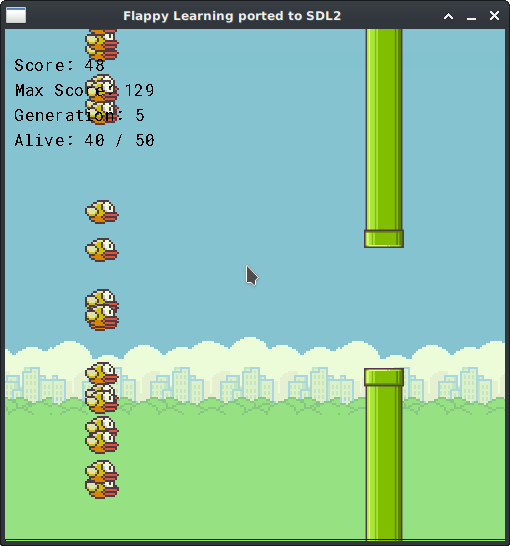

# Flappylearning-V-SDL2
Flappy learning, implemented in V, adapted to run with SDL2, instead of GG

See also the GG version in the main V repository:
https://github.com/vlang/v/blob/master/examples/flappylearning/

## Get started:

You will need to install the SDL2 wrapper, since it is not bundled in vlib.
It is a one time operation, and you can do it like this:
```sh
v install sdl
v run ~/.vmodules/sdl/setup.vsh
```

If you are on windows, you will also need to run:
```cmd
~/.vmodules/sdl/windows_install_dependencies.vsh
```

## Compiling and running the example:
```
v run .
```



## thanks
https://github.com/xviniette/FlappyLearning

## license
MIT
